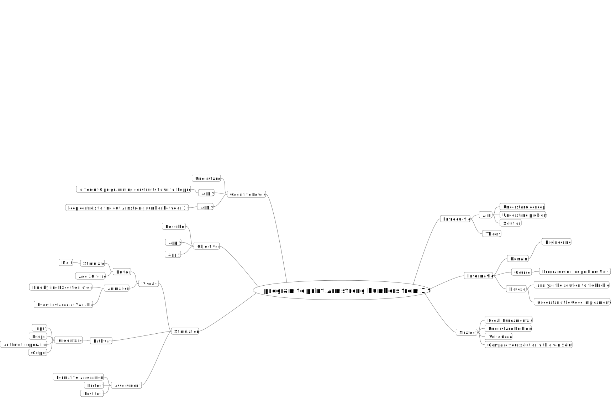

## Storyboard (Round 2)

Experiment 1: WAP to print Armstrong numbers from 1 to 100.

### 1. Story Outline:

The experiment is based on Armstrong Numbers. Students approaches the simulator to understand the concept Armstrong numbers. An Armstrong number is a n-digit number that is equal to the sum of nth power of its digits. For example, 6 = 6^1 = 6 371 = 3^3 + 7^3 + 1^3 = 371. The objective of the experiment is to find Armstrong numbers between 1 to 100.

### 2. Story:

In number theory, an Armstrong number (after Michael F. Armstrong) also known as a narcissistic number in a given number base b is a number that is the sum of its own digits each raised to the power of the number of digits. Hence 153 because 13 + 53 + 33 = 1 + 125 + 27 = 153. The most principal information is that the number of Armstrong numbers for a particular base is finite. So, theoretically, you could list all Armstrong numbers up to a particular base. Armstrong numbers are certainly rare. They cannot have more than 60 digits in base 10, because for n > 60 = n · 9^n < 10^n-1.
Since there is an upper limit to their size, it is theoretically possible to find all of them, given sufficient computer time. However, 1060 is an unimaginably huge number, so such a "brute force" approach would be unwise. Luckily, D. Winter proved in 1985 that there are exactly 88 base-10 Armstrong numbers, and they must have 1, 3, 4, 5, 6, 7, 8, 9, 10, 11, 14, 16, 17, 19, 20, 21, 23, 24, 25, 27, 29, 31, 32, 33, 34, 35, 37, 38 or 39 digits. The Armstrong numbers up to 10 digits are

1, 2, 3, 4, 5, 6, 7, 8, 9, 153, 370, 371, 407, 1634, 8208, 9474, 54748, 92727, 93084, 548834, 1741725, 4210818, 9800817, 9926315, 24678050, 24678051, 88593477, 146511208, 472335975, 534494836, 912985153, 4679307774
The simulator will print the armstrong numbers between 1 to 100.

#### 2.1 Set the Visual Stage Description:
At the top of the page student will able to see heading of experiment and three options provided on dark bule menu. After click on simulation option student will redirect to simulation section. On the simulation section student will be able to see two containers. First container is marked as Code highlighted with green color and second container is marked as Execution highlighted in green. The code container is showing the code for finding out the armstrong numbers from 1 to 100. The excution container is consist of three sections. First section consist of two parameters that is Number and Number of digits. which will display the current number which is geeting checked and number of digits in the current number.
The second section is for calculating Power which is having seven parameters.  It will show the sum of power of digits in the current number. The next button is used to perform the next step in the code. The another button that is Add 10 to no. is providded to add 10 in the current number.

#### 2.2 Set User Objectives & Goals:
1. Describe the concept of Armstrong Numbers
2. Apply different C programming constructs to write the program
3. Apply the loop controls to find out Armstrong number between 1 to 100
4. Evaluate Armstrong number using C programming

#### 2.3 Set the Pathway Activities:
1. Click on simulation from top right corner of page.
2. Student will able to see the Code and Execution container.
3. Click on simulate button to start simulation
4. Click on Next button it will show the line by line excution of code
5. Execution container will show how the Armstrong numbers are getting calculated.
6. Click on Add 10 no. button it will add 10 to the current number and lop will satrt from current number + 10
7. Results are displayed at the end of Execution container. 

##### 2.4 Set Challenges and Questions/Complexity/Variations in Questions:

1. 1634 is Armstrong number <b>True</b> or False ?

2. Which of the following is Armstrong Number?
<b>a.153</b>
b. 121
c. 119
d. 1234

##### 2.5 Allow pitfalls:
This pitfall does not mean wrong answer and retrying. It is designed to clear misconceptions or incorrect knowledge. When the numbers are getting changed the student need to pay the attention to the pointer which is getting passed from one line of code to another line. few questions will be asked after the experiment based on the simulation.

##### 2.6 Conclusion:
Time required to perform the virtual experiment.
The approximate time required to understand the experiment would take about 5 min. To calculate the values it would take 2 min. Answering the assessment questions will take about 6 to 7 min.  Thus the total time required to perform the experiment will require around 15 min.

##### 2.7 Equations/formulas: NA
Formula for calculating Armstrong Number
</b>

### 3. Flowchart 
  
link to flow chart Here :<a href="https://github.com/patil-poojap/Techie-Tribe/blob/master/storyboard/flowchart/flowchart%20.png">flowchart</a>   
(guide :The lab proposer should extract logic from the story, prepare a flowchart from the story narration and write the algorithm to execute the black box.  use Google Drawings https://docs.google.com/drawings/ (send the link to your flowchart and also attach .png by exporting it )

### 4. Mindmap:

 Link to mindmap here : <a href="https://github.com/patil-poojap/Techie-Tribe/blob/master/storyboard/mindmap/mindmap.pdf" target="_blank">Mindmap.</a>
  
 (guide : An elaborate mind map (connecting all the points in the experiment flow ) should be prepared and submitted by the lab proposer. The mind map should be a clear and detailed document that takes into account all minute intri5acies involved in the development of virtual lab. The mindmap should be self-content and any developer across the globe should be able to code it with all those details. using only FreeMind http://freemind.sourceforge.net/wiki/index.php/Main_Page (send the .png file and also the original .mm extension project file. )

### 5. Storyboard :
Storyboard: 
